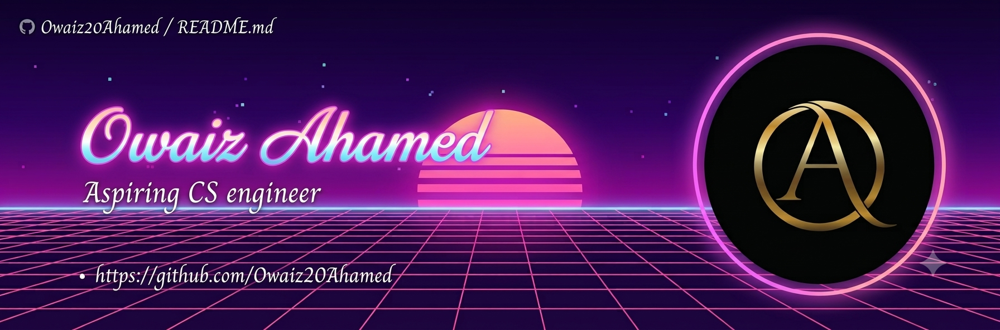

<picture>
   <source media="(prefers-color-scheme: dark)" srcset="art/header-dark.png">
   
</picture>

<picture>
  <source media="(prefers-color-scheme: dark)" srcset="https://capsule-render.vercel.app/api?type=waving&color=0:6C63FF,50:8B5CF6,100:3B82F6&height=280&section=header&text=Owaiz%20Ahamed&fontSize=60&fontColor=ffffff&animation=fadeIn&fontAlignY=38&desc=Aspiring%20Software%20Engineer%20•%20AI%2FML%20Enthusiast&descAlignY=60&descSize=20">
  <source media="(prefers-color-scheme: light)" srcset="https://capsule-render.vercel.app/api?type=waving&color=0:A855F7,50:7C3AED,100:2563EB&height=280&section=header&text=Owaiz%20Ahamed&fontSize=60&fontColor=ffffff&animation=fadeIn&fontAlignY=38&desc=Aspiring%20Software%20Engineer%20•%20AI%2FML%20Enthusiast&descAlignY=60&descSize=20">
  
</picture>

# Hey there, I'm Owaiz Ahamed 👋

  

---

## 
💫 About Me

<table>
<tr>

<td width="65%" valign="top">

### 👨‍💻 Who Am I?

🎓 **B.Tech Computer Science Engineering** student at **Presidency University**

💡 Passionate about building software that combines **AI, Data Analytics, and Full-Stack Development** to solve real-world problems.

### 🚀 Currently

- 🤖 Learning **Artificial Intelligence & Machine Learning**
- 📊 Exploring **Data Analytics & Power BI**
- 🌐 Building **Full-Stack Web Applications**
- ⚙️ Developing practical AI-powered projects
- 📚 Continuously improving problem-solving & software engineering skills

### 🎯 Looking For

- 💼 Software Engineering Internships
- 🤝 Open Source Collaborations
- 🚀 Exciting AI & Web Development Projects
- 🌱 Opportunities to learn from experienced developers

</td>

<td width="35%" align="center">

</td>

</tr>
</table>

---

## 
💻 Tech Stack

  

---

## 
📈 GitHub Analytics

 

 

---

## 
🏆 GitHub Trophies

---

## 
🐍 Contribution Snake

## 
🌐 Connect With Me

---

## 
💭 Random Dev Quote

---

### ⭐ Thanks for stopping by!

*"Building intelligent software, one commit at a time."*

<picture>
  <source media="(prefers-color-scheme: dark)" srcset="https://capsule-render.vercel.app/api?type=waving&color=0:3B82F6,50:8B5CF6,100:6C63FF&height=140&section=footer">
  <source media="(prefers-color-scheme: light)" srcset="https://capsule-render.vercel.app/api?type=waving&color=0:A855F7,50:7C3AED,100:2563EB&height=140&section=footer">
  
</picture>
